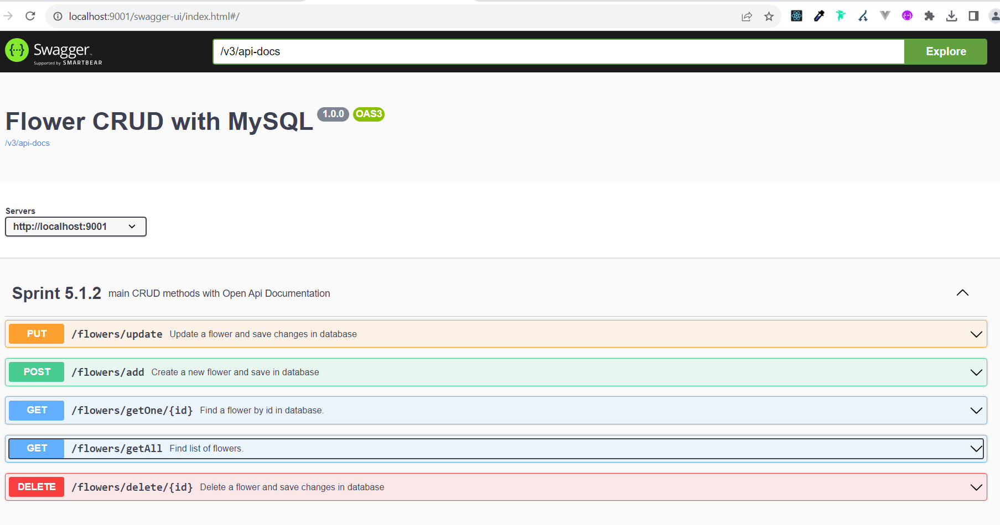
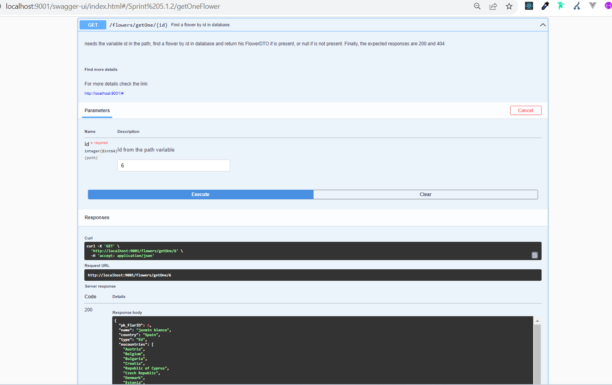
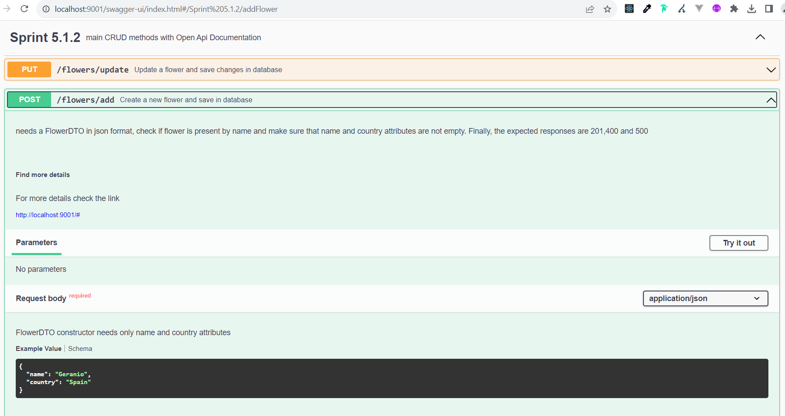
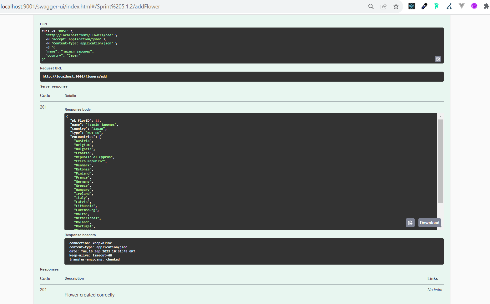

## API REST with MYSQL - Flower CRUD

### Swagger documentations
[Enlace swagger](http://localhost:9001/swagger-ui/index.html)

### Swagger view

### There are some examples:

#### Example GET One

#### Example POST

#### Example Response POST

